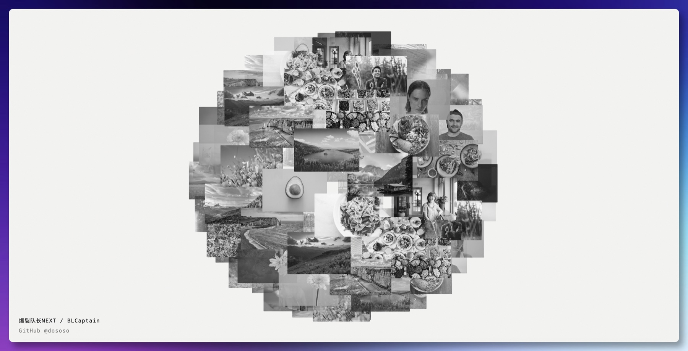
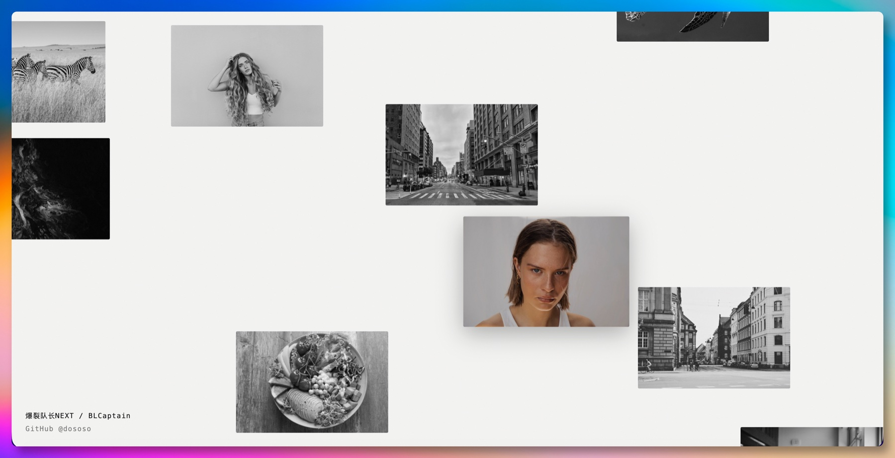

# 无限交互画廊

[English](README.md) · 中文

[](LICENSE)   

> 100 张照片从中心喷涌而出、在无限平面上漫游、聚合成缓慢自转的 3D 星球,最后像老电视一样关机 —— 纯 DOM + CSS + GSAP,**零 WebGL**。

<div align="center">
  
  <br><sub>滚轮内缩 —— 100 张图聚成一颗缓慢自转的 3D 星球,始终居中。</sub>
</div>

## 交互

| 阶段 | 操作 | 效果 |
|---|---|---|
| **入场** | 点击 / 轻触 | 图片从中心涌现,爆发成黄金角圆盘,散成稀疏平面 |
| **漫游** | 拖动 / 方向键 | 四向无限滚动,拖哪滚哪的松手惯性;悬停揭色 |
| **星球** | 滚轮 / 双指 | 平面 ⇄ 斐波那契球面,一次连续 morph(缓慢自转、始终居中) |
| **关机** | 滚到底 / 捏到底 | 火箭缩 + CRT 关机:压成横线 → 收成点 → 白光余晖 → 黑幕 |

<div align="center">
  
  <br><sub>拖动即可四向漫游无限平面 —— 悬停揭色。</sub>
</div>

## 怎么做到的

- **纯 DOM + CSS + GSAP**,ES modules,零构建 —— 克隆即跑。
- **R2 塑性常数点阵** 散布 100 张图:比泊松盘更均匀、天然环面无缝,乱中有黄金秩序。
- **矩形 AABB 分离** 消除每一处边角重叠。
- **斐波那契球面 + 透视投影** 驱动平面 ⇄ 球的连续 morph。
- **World / Camera 架构** —— 一层 transform 承载无限画布,视口外 recycle 四向循环。

完整技术说明见 [docs/DESIGN.md](docs/DESIGN.md)。

## 运行

```bash
python3 -m http.server 5173
# 打开 http://localhost:5173
```

纯静态零构建 —— 根目录直接部署到任意静态托管(Cloudflare Pages / GitHub Pages / Netlify)。

## 调参

URL query 实时调参,无需改代码:`?n=100` `?mind=330` `?dens=0.72` `?demo=1` ……(完整表见 [docs/DESIGN.md](docs/DESIGN.md))。

## 测试

```bash
node --test test/geometry.test.js
```

## 关于作者

**无限交互画廊** 由 **爆裂队长NEXT(BLCaptain)** 独立创作与维护。

- GitHub:[@dososo](https://github.com/dososo)
- X / Twitter:[@thinkszyg](https://x.com/thinkszyg)
- 邮箱:blteam2026@outlook.com

欢迎在 [Issues](https://github.com/dososo/infinite-image-gallery/issues) 提反馈、提需求。如果这个项目对你有用,欢迎 Star。

## License

MIT —— 详见 [LICENSE](LICENSE)。图片素材来自 [Unsplash](https://unsplash.com)(Unsplash License);逐张署名见 [assets/credits.md](assets/credits.md)。
